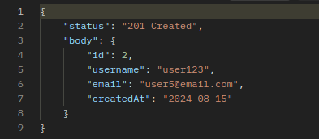
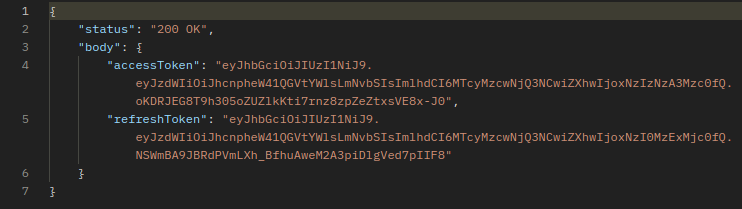
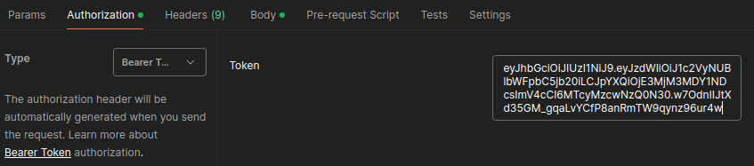
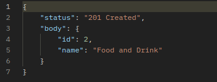
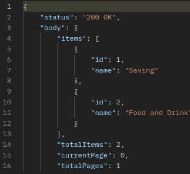
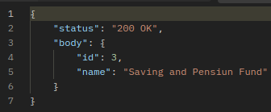
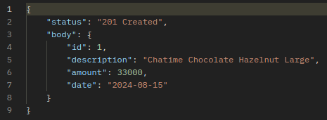
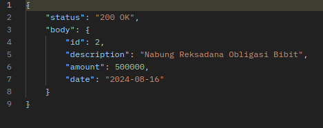
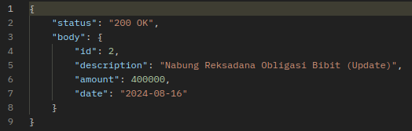

# INTRODUCTION
This application is backend program that built using Java as the programming language and using Spring Boot Framework. For database management this app using PostgreSQL and also implements JWT Security for user authentication and generating token.

Developed by : Nabila Suci Syabani - Batch #17 Offline Jakarta

### AUTHENTICATION
#### REGISTER
```http
  POST /api/register  
```
##### INPUT
```json
{
  "email" : "user5@email.com",
  "username" : "user123",
  "password" : "userpass123"
}
```
##### OUTPUT


#### LOGIN
```http
  POST /api/login  
```
##### INPUT
```json
{
  "username" : "user123",
  "password" : "userpass123"
}
```
##### OUTPUT



### CATEGORY
#### CREATE CATEGORY (AUTHENTICATED)
```http
  POST /api/categories
```
##### INPUT
````
Authorization (Add Login Token)
Type - Bearer Token
Token = {add token when login}
````

```json
{
  "name" : "Food and Drink"
}
```
##### OUTPUT


#### GETALL CATEGORY (AUTHENTICATED)
```http
  GET /category-products
```
##### INPUT
````
Authorization (Add Login Token)
Type - Bearer Token
Token = {add token when login}
````


##### OUTPUT



#### UPDATE BY ID CATEGORY (AUTHENTICATED)
```http
  PUT /categories/{id}
```
##### INPUT
````
Authorization (Add Login Token)
Type - Bearer Token
Token = {add token when login}
````

```json
{
  "name" : "Saving and Pension Fund"
}
```
##### OUTPUT



### EXPENSES
#### CREATE EXPENSES (AUTHENTICATED)
```http
  POST /api/expenses
```
##### INPUT
````
Authorization (Add Login Token)
Type - Bearer Token
Token = {add token when login}
````

```json
{
  "description": "Chatime Chocolate Hazelnut Large",
  "amount" : "33000",
  "date": "2024-08-15",
  "category_id" : "2"
}
```
##### OUTPUT


#### GET EXPENSES (AUTHENTICATED)
```http
  GET /api/expenses
```
##### INPUT
````
Authorization (Add Login Token)
Type - Bearer Token
Token = {add token when login}
````

##### OUTPUT



#### UPDATE BY ID EXPENSES (AUTHENTICATED)
```http
  PUT /api/expenses/{id}
```
##### INPUT
````
Authorization (Add Login Token)
Type - Bearer Token
Token = {add token when login}
````

```json
{
  "description": "Nabung Reksadana Obligasi Bibit (Update)",
  "amount" : "400000",
  "date": "2024-08-16",
  "category_id" : "1"
}
```
##### OUTPUT

